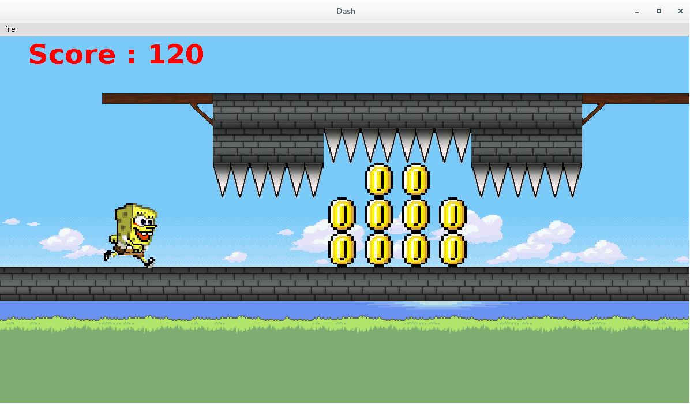

# Game Framework

[](https://travis-ci.org/christian/lille-game-framework)

Pour autant que je sache, ce jeu  a surtout été écrit par David
Auber et contient beaucoup de contributions de Philippe Narbel et
Damien cassou.


To launch the tests, type:

```bash
$ mvn test
```

To develop your own game on top of this framework, you first have to
install the framework. That way, when compiling your game, maven will
find the framework:

```bash
$ mvn install
```

## Student Games

### 2016





