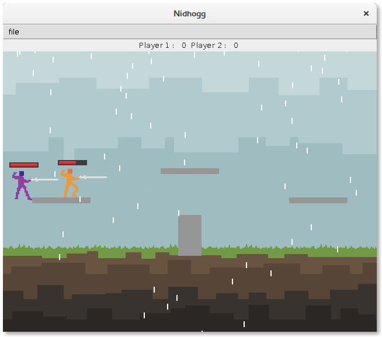

# Game Framework

[](https://travis-ci.org/DamienCassou/lille-game-framework)

As far as I know, this game framework has mostly been written by David
Auber and contains a lot of contributions from Philippe Narbel and
Damien Cassou.

Pour lancer les tests, tapez :

```bash
$ mvn test
```

## Student Games

### 2016





